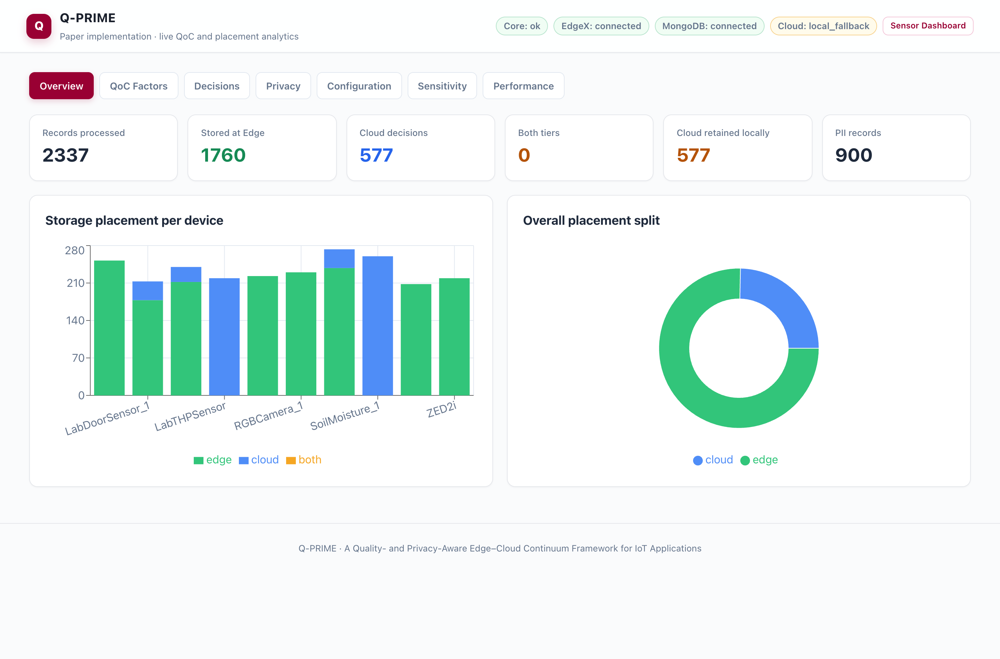
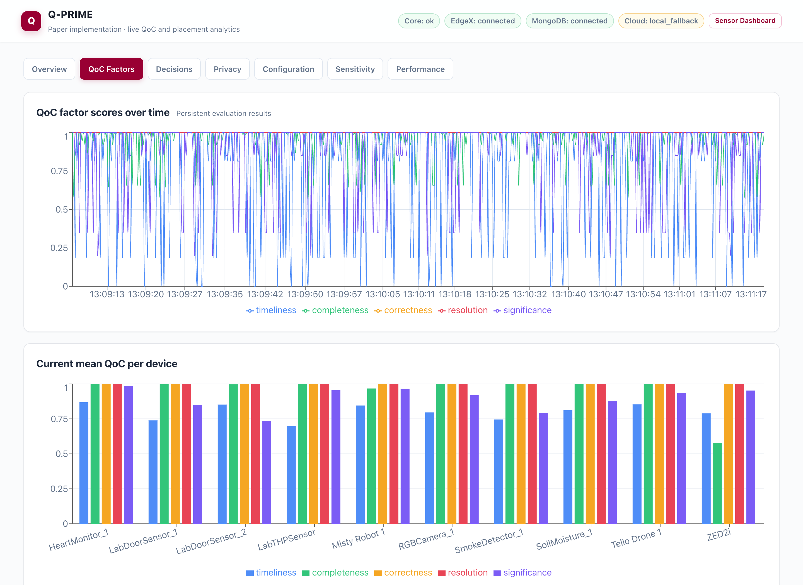
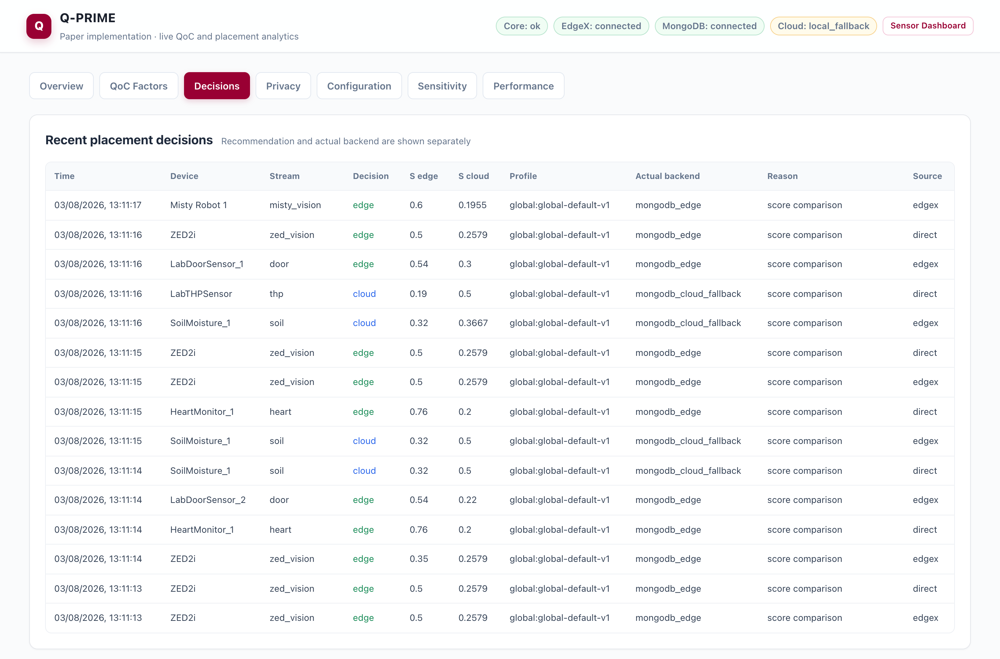
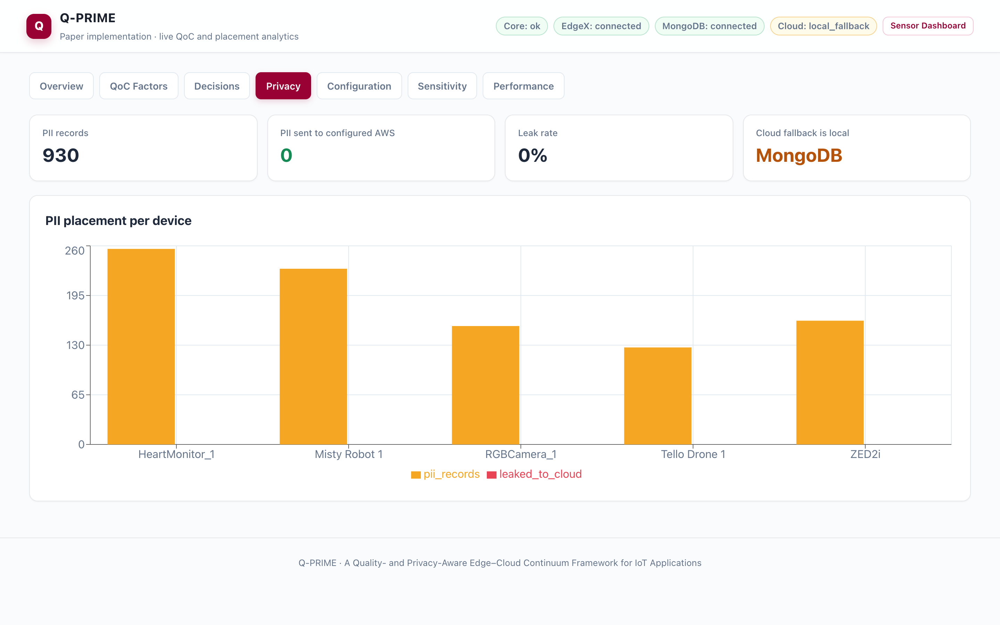
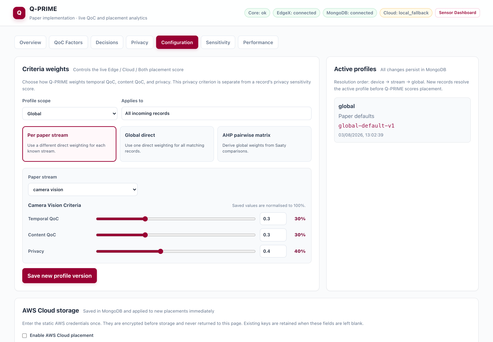
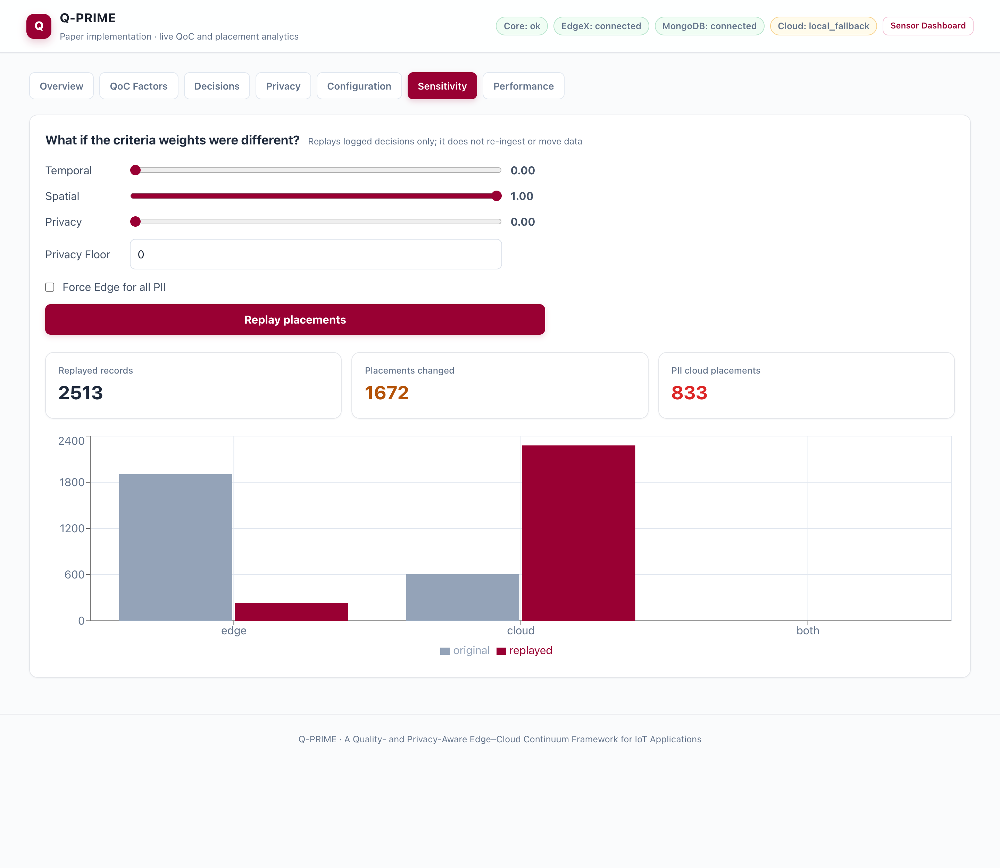
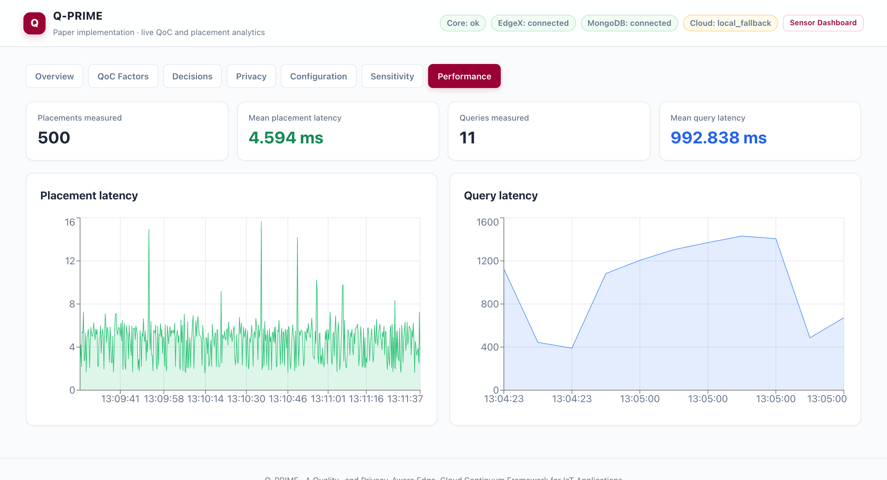
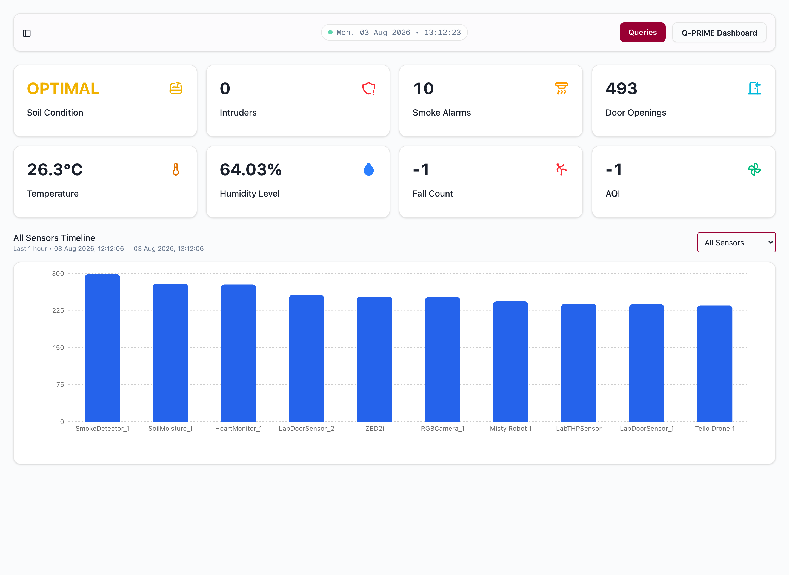
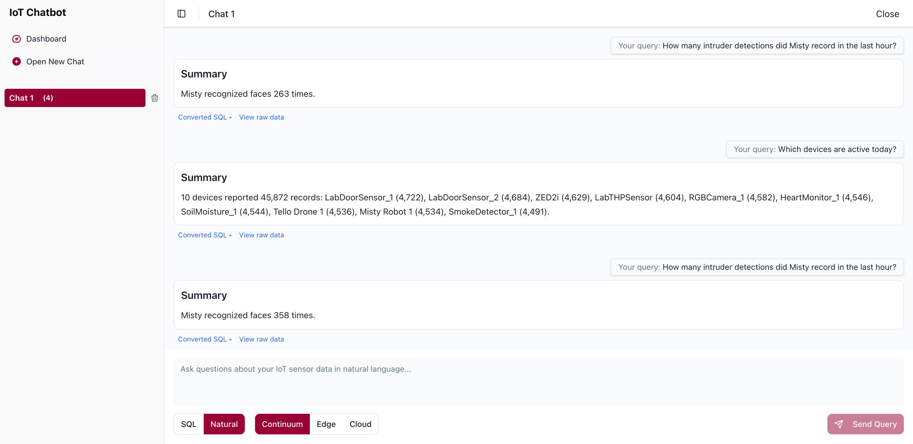

# Q-PRIME

**A Quality- and Privacy-Aware Edge–Cloud Continuum Framework for Internet of Things Applications**

Q-PRIME decides, **per IoT record and in real time**, whether data belongs at the
edge or in the cloud. Every record is scored on five Quality-of-Context factors,
combined with a privacy weight through configurable criteria weights, and routed
to the tier that wins the resulting score comparison — with the full explanation
retained for every decision.

This repository is the complete implementation: the paper's algorithms, EdgeX
Foundry integration for real devices, MongoDB edge storage, optional AWS cloud
storage, a unified read-only SQL surface over both tiers, and the natural-language
query application.

```bash
git clone https://github.com/JahedulAnowar/Q-PRIME-2026.git
cd Q-PRIME-2026
docker compose up -d --build
```

Then open **<http://localhost:3000/qprime>**. No `.env`, no configuration, no
manual data loading — a bundled ten-device feed starts producing records
immediately, so the dashboards are populated within seconds of the stack coming up.

---

## Features

### Per-record Edge / Cloud placement

Every ingested record is scored and placed. The overview reports the live split
across tiers and per device, alongside PII counts and cloud-fallback usage.



### Five Quality-of-Context factors, scored continuously

Timeliness, completeness, correctness, resolution and significance are evaluated
per record against per-stream latency thresholds and JSON schemas, then tracked
over time and averaged per device. After a device's first record, Q-PRIME
switches to a persistent adaptive baseline: the latency threshold follows an
EWMA of observed delay rather than a fixed constant.



### Every decision is explainable

Each placement records both scores, the effective weight profile and version, the
reason, the actual storage backend, and which entry point the record arrived
through — `direct` for API producers, `edgex` for real devices.



### Privacy accounting

PII is detected from record payloads — identities, names, ages, SSNs, and person
detections from vision streams. A record marked `privacy_filter: strict` bypasses
scoring entirely and is pinned to the edge. The dashboard tracks how many
PII-carrying records exist and how many ever reached a configured cloud backend.



### Configurable criteria weights, including AHP

Weights resolve per device → per stream → global. Choose direct per-stream
weights (the paper's default), one global triple, weights derived from the six
individual metric weights, or a global Analytic Hierarchy Process matrix built
from Saaty pairwise comparisons with its consistency ratio reported and enforced
at ≤ 0.10. Every change is versioned and audited. The same tab configures AWS
cloud storage — credentials are encrypted before storage and never returned to
the page.



### Sensitivity explorer

Replay every logged decision under different criteria weights without re-ingesting
or moving any data — the fastest way to see what the privacy term is actually
buying you. The run below drops privacy and temporal weight entirely
(content-only weighting) against the same records:



### Performance instrumentation

Placement and query latency are measured for every operation and retained, so
overhead is observable rather than asserted.



### Natural-language and SQL queries across both tiers

One logical table, `qprime.continuum`, spans edge and cloud. Ask in English or
write SQL, and scope the query to the edge, the cloud, or the whole continuum.
Rule-based SQL generation and summarisation are the default; a local LLM is
optional.



The Fall Count and AQI tiles stay at `-1` because no device in the paper's
testbed reports either; every other tile is live.



---

## What the first run produces

Measured on a clean stack (`docker compose down -v` then `docker compose up -d --build`)
driven only by the bundled feed. Your numbers will differ — the feed is
randomised — but the shape is reproducible.

| Measure | Result |
|---|---|
| Records processed | 2,693 |
| Placed at edge | 2,047 (76%) |
| Placed in cloud | 646 (24%) |
| PII-carrying records | 1,049 |
| **PII records placed in the cloud tier** | **0** |
| Placement decision latency | 4.59 ms mean, 4.97 ms p50, 6.60 ms p95 |
| Entry points exercised | 50% `direct`, 50% `edgex` |

Not one PII-carrying record was *recommended* for the cloud, so none was written
to any cloud backend. The dashboard's "leak rate" is stricter still — it counts
only records that reached a configured AWS backend.

Replaying those same decisions with the privacy and temporal terms removed
(content-only weights) changes **1,802 of 2,693 placements** and sends
**902 PII records to the cloud**. Re-enabling the paper's strict-all-PII
mitigation on top of the same content-only weights returns that to **0**. The
privacy term is doing real work, and the explorer lets you demonstrate it in one
click.

> **On the bundled feed.** `qprime-devices` generates synthetic readings for the
> paper's ten-device testbed so the stack is demonstrable without lab hardware.
> The decision engine, QoC scoring, privacy analysis and placement it drives are
> the real implementation — only the device readings are generated. Stop it with
> `docker compose stop qprime-devices` to run against real traffic only. See
> [services/devices/README.md](services/devices/README.md).

---

## Quick start

Requirements: Docker 24+ with Compose v2, and about 10 GB free disk.

```bash
docker compose up -d --build
```

That is the whole setup. `.env` is optional and only needed for host-port
remapping, tuning the bundled feed, or the optional local LLM — see
[.env.example](.env.example). AWS is configured from the dashboard, not from a
file.

First run pulls and builds roughly 8.3 GB of images — PrestoDB alone is 4.8 GB —
so expect several minutes. Once images are cached the command returns in about
30 seconds and all fifteen containers report healthy shortly after.

| Service | URL | Purpose |
|---|---|---|
| Q-PRIME dashboard | <http://localhost:3000/qprime> | QoC, placements, privacy, weights, sensitivity, performance |
| Query application | <http://localhost:3000> | Natural-language / SQL queries and device charts |
| Core API | <http://localhost:5005> | Ingestion, paper algorithms, persistence, query routing |
| NLP API | <http://localhost:5500> | Natural language to SQL and result summarisation |
| PrestoDB | <http://localhost:8085> | SQL over MongoDB and the continuum union |
| MongoDB 8 | `localhost:27017` | Edge records, cloud fallback, policies, decisions, audit |
| EdgeX 4.0.2 | `localhost:59880–59890` | Real-device integration and event export |

Common operations:

```bash
docker compose ps            # status
docker compose logs -f       # follow logs
docker compose down          # stop, keep data
docker compose down -v       # stop and delete all stored data
```

`make up`, `make down`, `make logs`, `make ps` and `make clean` wrap the same commands.

---

## Architecture

```text
raw data record ─────────────────┐
                                 ├─> Q-PRIME ingestion
real device -> EdgeX -> export ──┘       -> QoC + privacy evaluation
                                         -> profile weights / AHP
                                         -> Edge | Cloud | Both decision
                                         -> MongoDB Edge collection
                                         -> AWS when configured, otherwise MongoDB Cloud fallback

question -> NLP -> read-only SQL -> PrestoDB / Athena -> answer and charts
                                  -> /qprime results and configuration UI
```

Q-PRIME never moves retained fallback records into AWS. Once AWS is configured,
new cloud decisions are written there and cloud queries are sent there; earlier
fallback records remain in MongoDB for history and visualisation.

---

## The placement algorithm

```text
QoC_temporal = mean(timeliness, resolution)
QoC_content  = mean(completeness, correctness, significance)

S_edge  = w_temporal * QoC_temporal + w_privacy * P
S_cloud = w_content  * QoC_content
```

`P` is the stream's privacy weight in `[0, 1]`. **Edge** wins if `S_edge > S_cloud`,
**Cloud** if `S_cloud > S_edge`, **Both** on a tie. Two overrides short-circuit
scoring entirely: a record flagged `privacy_filter: strict`, and — when
`strict_privacy_all_pii` is enabled — any record carrying PII. Both are pinned to
the edge.

The five factors:

| Factor | Definition |
|---|---|
| Timeliness | `1 − delay / threshold`, against per-stream latency thresholds; adaptive after the first record |
| Completeness | Fraction of schema-expected fields present |
| Correctness | Type, range and required-field rule checks (no rules ship by default — see [documents/METRICS.md](documents/METRICS.md)) |
| Resolution | Derived from the record's reported refresh rate |
| Significance | Event-content heuristic; heartbeat/status events score low |

---

## Ingestion

Direct producers send one canonical record to `POST /api/ingest`:

```bash
curl -X POST http://localhost:5005/api/ingest \
  -H 'Content-Type: application/json' \
  -d '{
    "contextAttribute": "door",
    "contextValue": {"event": "opened"},
    "resource": {"device_id": "door-1", "device_name": "Door 1"},
    "refreshRate": 1000,
    "timestamp": 1785312000000
  }'
```

Real devices use the bundled EdgeX services. EdgeX's `http-export` application
service forwards events to `POST /api/ingest/edgex`; both entry points run the
same pipeline. Record IDs are deterministic and repeated deliveries are idempotent.

Canonical metadata travels from EdgeX as **device tags** — `contextAttribute`,
`refreshRate`, `privacy_filter`, `device_id`, `gateway_id` — so EdgeX-sourced
records are scored identically to directly posted ones. The bundled feed
registers its devices this way and can drive either path; see
[services/devices/README.md](services/devices/README.md).

---

## Placement and persistence

MongoDB database `qprime` contains:

- `edge_records` — records placed at the edge;
- `cloud_records` — locally retained cloud decisions when AWS is absent or a write fails;
- `placement_decisions` — immutable recommendations, scores, effective profile, actual backend;
- `weight_profiles` and `configuration_history` — versioned global/stream/device policy and audit history;
- `cloud_configuration` — active AWS settings and encrypted static credentials;
- `qoc_baselines` — persistent adaptive QoC state;
- `query_metrics` — query latency and source evidence.

Configuration resolution is `device → stream → global`. The Configuration tab
provides structured controls for per-stream and global direct weights, plus the
three-criterion AHP pairwise matrix. Saving a profile activates it for future
records; it does not move or recompute existing ones.

---

## Querying

The logical table is `qprime.continuum`. The core accepts read-only SQL through:

```http
GET /api/query?query=<SQL>&isCloud=<continuum|false|true>
```

- `false` — MongoDB `edge_records` through PrestoDB;
- `true` — the configured Athena database/table when AWS is enabled, otherwise MongoDB `cloud_records`;
- `continuum` — edge MongoDB plus the active cloud source.

Only one read-only statement targeting the logical table is accepted, and
non-aggregate queries receive a server-side row limit.

```bash
curl -G http://localhost:5005/api/query \
  --data-urlencode "query=SELECT resource.device_name AS device, COUNT(*) AS n
                          FROM qprime.continuum GROUP BY resource.device_name" \
  --data-urlencode "isCloud=continuum"
```

When Athena is the active cloud source, cloud SQL is rewritten internally from
`qprime.continuum` to the configured Athena database and table. A single
ungrouped `AVG(...)` continuum query is combined correctly as a weighted average
from each tier's `SUM` and `COUNT`; grouped or multi-average continuum queries
are not currently supported.

---

## AWS Cloud

Configure the cloud tier from **Configuration → AWS Cloud storage** in the
dashboard — no environment variables and no credentials in the repository. The
form persists the region, the Firehose or Kinesis delivery stream, and the
optional Athena database, table, workgroup and output location. Static access
keys, secret keys and session tokens are encrypted before persistence and are
write-only in both the UI and the API:

```text
GET|PUT /api/cloud/config          # read and update the cloud configuration
POST    /api/cloud/config/probe    # verify credentials and reachability
```

The encryption key lives in the `qprime-core-secrets` named volume. Keep it
alongside the MongoDB volume across restarts — deleting it makes existing
encrypted credentials unreadable and they must be entered again. AWS environment
variables remain a legacy fallback, used only when no dashboard configuration
has been saved.

Until AWS is configured, cloud-placed records are retained locally in MongoDB
and clearly labelled `mongodb_cloud_fallback` in the UI and API.

---

## Core API

```text
GET  /api/health
POST /api/ingest
POST /api/ingest/edgex
POST /api/analyze
GET  /api/query
GET  /api/config
PUT  /api/config
GET|POST /api/config/profiles
GET  /api/config/history
POST /api/config/ahp
GET|PUT /api/cloud/config
POST /api/cloud/config/probe
GET  /api/results/{overview,decisions,qoc,privacy,performance}
POST /api/results/sensitivity
```

`GET /api/results/decisions` accepts `device`, `stream`, `source`,
`recommendation`, `backend`, `pii`, `from_ms`, `to_ms` and `limit` filters.

---

## Development

```bash
python -m pytest tests/ -v          # algorithm and NLP tests
python scripts/reproduce_paper.py   # paper algorithms over its representative records

pip install -r services/core/requirements.txt -r services/nlp/requirements.txt
python services/core/app.py

cd services/nlp-web
npm install
npm run dev
```

---

## Troubleshooting

| Symptom | Cause and fix |
|---|---|
| A host port is already allocated | Override it in `.env` — every published port is configurable. Presto defaults to 8085 and the EdgeX MQTT broker to 1884 to stay clear of common conflicts. |
| `Conflict. The container name ... is already in use` | Another stack is using the name. All containers here are prefixed `qprime-`; remove the conflicting container or rename it. |
| `network ... has incorrect label` | A stale network from an older Compose project claiming the same name. `docker network rm <name>`, then bring the stack up again. |
| Dashboards show zeros | The feed waits for the core to report healthy. Check `docker compose logs qprime-devices`. |
| `Q-PRIME API unavailable` in the UI | The core is still starting. `docker compose ps` — wait for `qprime-analysis` to be `healthy`. |
| EdgeX containers restarting | EdgeX needs its Postgres and message bus first. They are health-gated, but a very slow first boot can take a few minutes. |
| Want a clean slate | `docker compose down -v` deletes all stored records, decisions and policy history. |

---

## Repository layout

```text
docker-compose.yml   # the entire stack, zero configuration
infra/presto/        # PrestoDB MongoDB connector configuration
services/core/       # paper algorithms, ingestion, placement, persistence, query API
services/devices/    # bundled synthetic device feed (demonstration only)
services/nlp/        # natural-language SQL generation and summarisation
services/nlp-web/    # query application plus the /qprime dashboard
scripts/             # paper reproduction
tests/               # algorithm and API tests
documents/           # architecture, device and metric notes, plus screenshots
```

---

## Related repository

[**KSJ-CDMS/Q-PRIME-Simulator**](https://github.com/KSJ-CDMS/Q-PRIME-Simulator) is a
companion simulation environment for reproducing and exploring the paper's
results with an interactive device generator. This repository is the full
deployable implementation, including the EdgeX integration and the query
application.

---

## Citation and license

If you use Q-PRIME, please cite the paper — see [CITATION.cff](CITATION.cff):

> K. S. Jagarlamudi *et al.*, "A Quality- and Privacy-Aware Edge–Cloud Continuum
> Framework for Internet of Things Applications", *IEEE Access* (under review), 2026.

Licensed under the [MIT License](LICENSE).
