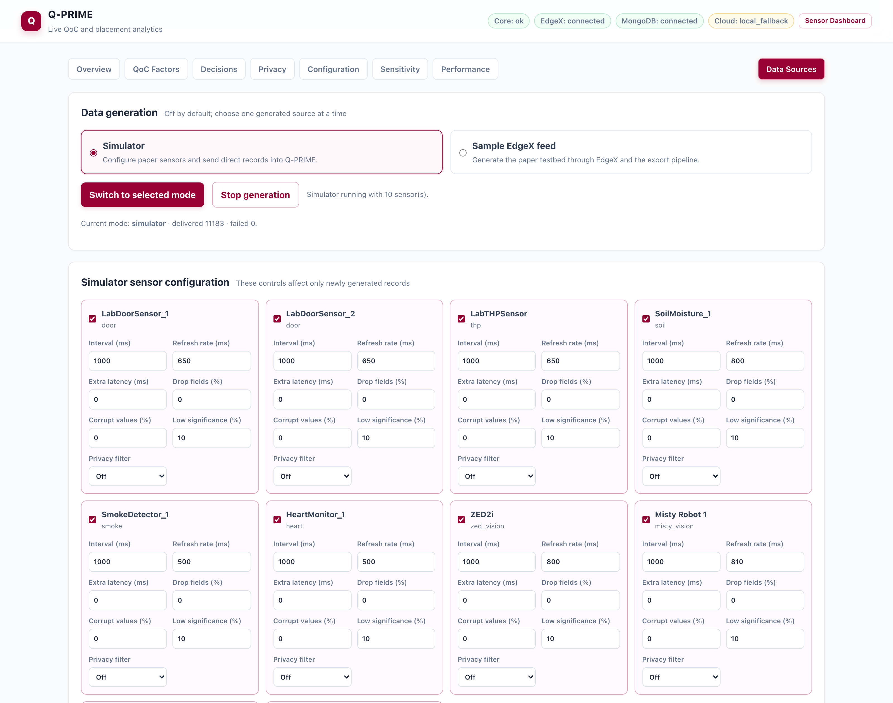
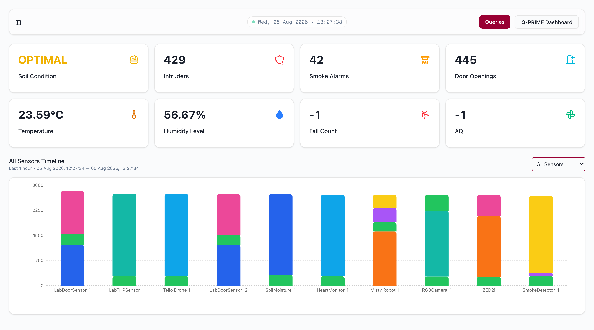
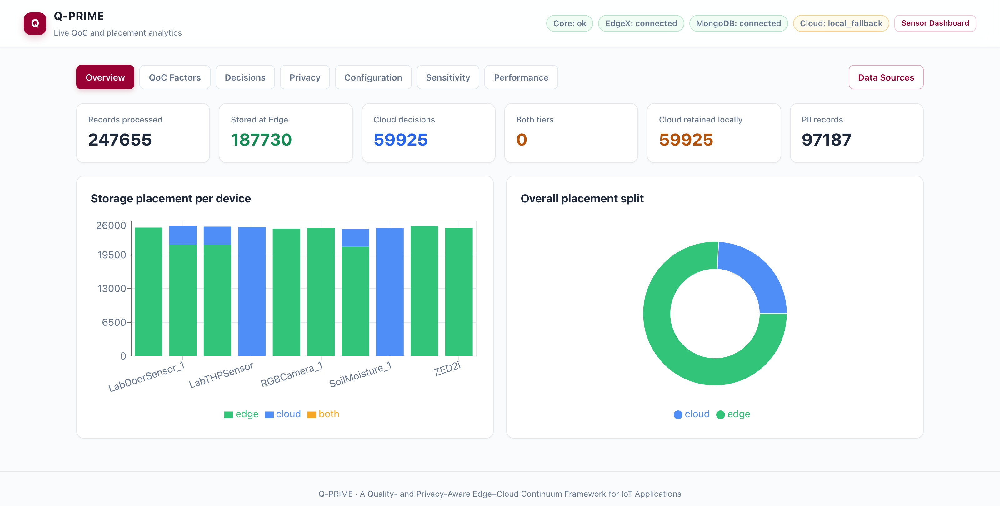
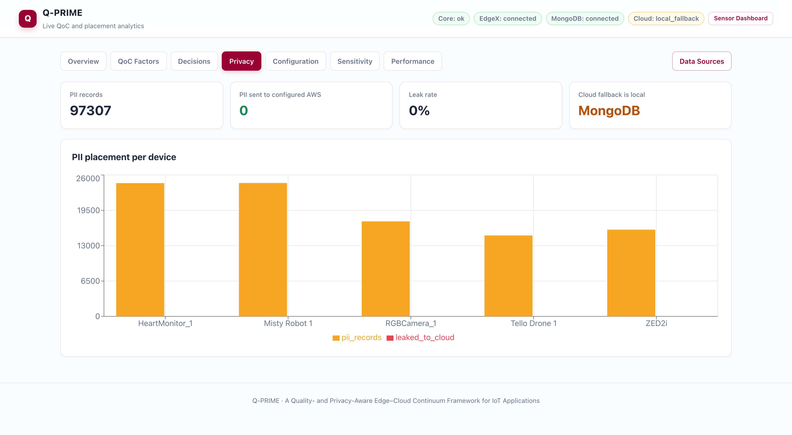
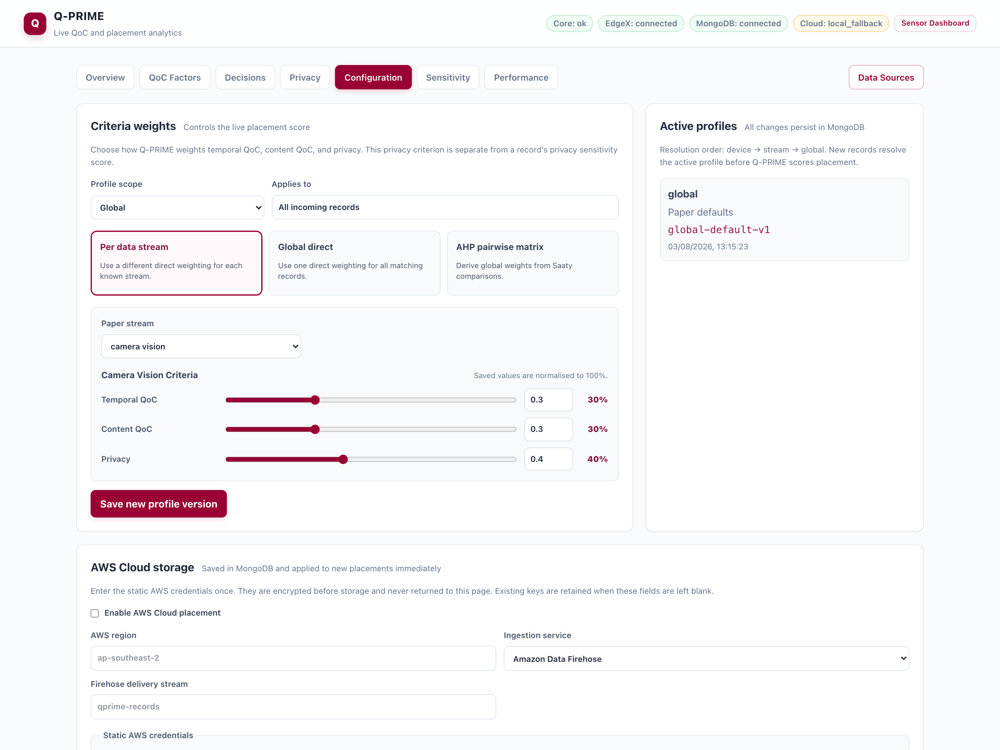

# Q-PRIME

**A Quality- and Privacy-Aware Edge–Cloud Continuum Framework for Internet of Things Applications**

Q-PRIME decides, **per IoT record and in real time**, whether data belongs at the
edge or in the cloud. Every record is scored on five Quality-of-Context factors,
combined with a privacy weight through configurable criteria weights, and routed
to the tier that wins the resulting score comparison — with the full explanation
retained for every decision.

This repository is the complete implementation: the paper's algorithms, EdgeX
Foundry integration for real devices, MongoDB edge storage, optional AWS cloud
storage, a unified read-only SQL surface over both tiers, and the
natural-language query application.

---

## Getting started

Requirements: Docker 24+ with Compose v2, and about 10 GB free disk.

### 1. Start the stack

```bash
git clone https://github.com/JahedulAnowar/Q-PRIME-2026.git
cd Q-PRIME-2026
docker compose up -d --build
```

That is the whole setup — no `.env` file is required. Every variable carries a
working default, and AWS is configured from the dashboard rather than from a
file. `.env` is only needed to remap host ports, tune the Sample EdgeX Feed, or
enable the optional local LLM; see [.env.example](.env.example).

First run pulls and builds roughly 8.3 GB of images — PrestoDB alone is 4.8 GB —
so expect several minutes. Once images are cached the command returns in about
30 seconds and all sixteen containers report healthy shortly after.

### 2. Turn on a data source

Open **<http://localhost:3000/qprime>** and go to the **Data Sources** tab.

The stack deliberately starts with data generation **off**, so nothing is
written until you choose a source. Pick one of the two generated modes and press
**Start selected mode** — or skip this step entirely and connect real devices
through EdgeX instead.

### 3. Watch it work

| Open | For |
|---|---|
| <http://localhost:3000> | Live sensor tiles and charts |
| <http://localhost:3000/qprime> | Placement decisions, QoC, privacy, weights, performance |
| <http://localhost:3000/queries> | Ask questions in English or SQL |

```bash
docker compose ps            # status
docker compose logs -f       # follow logs
docker compose down          # stop, keep data
docker compose down -v       # stop and delete all stored data
```

`make up`, `make down`, `make logs`, `make ps` and `make clean` wrap the same
commands.

---

## The screens

### Data Sources — choose what produces records

The first tab to visit. **Simulator** sends selected sensors straight to
`POST /api/ingest`, with per-sensor controls for interval, refresh rate, added
latency, dropped fields, corrupted values, low-significance rate and privacy
filter — so you can drive any QoC factor to any value and watch the placement
change. **Sample EdgeX Feed** provisions the same testbed inside EdgeX and
routes every reading through the real device → core-data → export path. The two
are mutually exclusive, and both are off again after a restart.



### Sensor dashboard — what the deployment is sensing right now

The operational view at <http://localhost:3000>: current soil condition,
intruder detections, smoke alarms, door openings, temperature and humidity, over
a selectable time range, plus a per-device event breakdown. Every tile is a live
read of the `qprime.continuum` SQL surface, so it reflects records from both
tiers at once.



The Fall Count and AQI tiles stay at `-1` because no device in the paper's
testbed reports either; every other tile is live.

### Query assistant — ask across both tiers in English or SQL

<http://localhost:3000/queries> turns a question into read-only SQL against the
single logical table, runs it, and summarises the answer. Each answer reports
how many records came from the edge and how many from the cloud, and the
generated SQL and raw rows are one click away. Scope any question to the edge,
the cloud, or the whole continuum.


### Overview — where the data actually landed

The headline split. How many records were processed, how many were stored at the
edge, how many were recommended for the cloud, how many carry PII, and how much
cloud-bound data is being retained locally because no AWS backend is configured
yet.



### QoC Factors — the five scores behind every decision

Timeliness, completeness, correctness, resolution and significance, evaluated
per record against per-stream latency thresholds and JSON schemas, tracked over
time and averaged per device. After a device's first record Q-PRIME switches to
a persistent adaptive baseline: the latency threshold follows an EWMA of
observed delay rather than a fixed constant. This is the tab to watch while you
change a sensor's settings on the Data Sources tab.


### Decisions — why each individual record went where it went

One row per placement: both scores, the effective weight profile and version,
the reason, the actual storage backend, and which entry point the record arrived
through — `direct` for API producers, `edgex` for devices. Records pinned by
`privacy_filter: strict` show the override instead of a score comparison.


### Privacy — what PII exists and whether any of it left the edge

PII is detected from record payloads: identities, names, ages, SSNs, and person
detections from vision streams. This tab counts how many PII-carrying records
exist per device and how many ever reached a *configured* cloud backend.



### Configuration — the weights that drive placement, and the AWS target

Criteria weights resolve per device → per stream → global. Choose direct
per-stream weights (the paper's default), one global triple, or a global
Analytic Hierarchy Process matrix built from Saaty pairwise comparisons, with
its consistency ratio reported and enforced at ≤ 0.10. Every change is versioned
and audited. The same tab configures AWS cloud storage — credentials are
encrypted before storage and never returned to the page.



### Sensitivity — what different weights would have done

Replay every logged decision under different criteria weights without
re-ingesting or moving any data. The fastest way to show what the privacy term
is actually buying you: the run below drops privacy and temporal weight entirely
and replays the same records.


### Performance — the overhead, measured rather than asserted

Placement and query latency are recorded for every operation and retained, so
the cost of the decision path is observable.


---

## Generated demonstration data

The **Data Sources** tab offers two mutually exclusive, user-started modes.
Both are Off after startup and after restart; existing MongoDB records are
retained.

> **On generated modes.** The decision engine, QoC scoring, privacy analysis and
> placement are the real implementation — only the chosen device readings are
> generated. See [services/devices/README.md](services/devices/README.md).

The figures below come from one such run of the bundled ten-device testbed and
are illustrative, not data produced automatically by a fresh deployment.

| Measure | Result |
|---|---|
| Records processed | 249,443 |
| Placed at edge | 189,139 (76%) |
| Placed in cloud | 60,304 (24%) |
| PII-carrying records | 97,921 |
| **PII records placed in the cloud tier** | **0** |
| Placement decision latency | 8.2 ms mean over the last 500 placements |
| Continuum query latency | 1.3 s mean over the last 500 queries |

Not one PII-carrying record was *recommended* for the cloud, so none was written
to any cloud backend. The dashboard's "leak rate" is stricter still — it counts
only records that reached a configured AWS backend.

Replaying those same decisions with the privacy and temporal terms removed
(content-only weights) changes **163,960 of 249,487 placements** and sends
**82,962 PII records** to the cloud. Re-enabling the paper's strict-all-PII
mitigation on top of the same content-only weights returns that to **0**. The
privacy term is doing real work, and the explorer lets you demonstrate it in one
click.

---

## Architecture

```text
Simulator (when started) ────────┐
Sample EdgeX Feed (when started) ├─> Q-PRIME ingestion
real device -> EdgeX -> export ──┘       -> QoC + privacy evaluation
                                         -> profile weights / AHP
                                         -> Edge | Cloud | Both decision
                                         -> MongoDB Edge collection
                                         -> AWS when configured, otherwise MongoDB Cloud fallback

question -> NLP -> read-only SQL -> PrestoDB / Athena -> answer and charts
                                  -> /qprime results and configuration UI
```

Q-PRIME never moves retained fallback records into AWS. Once AWS is configured,
new cloud decisions are written there and cloud queries are sent there; earlier
fallback records remain in MongoDB for history and visualisation.

| Service | URL | Purpose |
|---|---|---|
| Q-PRIME dashboard | <http://localhost:3000/qprime> | QoC, placements, privacy, weights, sensitivity, performance |
| Query application | <http://localhost:3000> | Natural-language / SQL queries and device charts |
| Core API | <http://localhost:5005> | Ingestion, paper algorithms, persistence, query routing |
| NLP API | <http://localhost:5500> | Natural language to SQL and result summarisation |
| PrestoDB | <http://localhost:8085> | SQL over MongoDB and the continuum union |
| MongoDB 8 | `localhost:27017` | Edge records, cloud fallback, policies, decisions, audit |
| EdgeX 4.0.2 | `localhost:59880–59890` | Real-device integration and event export |
| EdgeX Console | <http://localhost:4000> | Device, profile, service and event management |

---

## The placement algorithm

```text
QoC_temporal = mean(timeliness, resolution)
QoC_content  = mean(completeness, correctness, significance)

S_edge  = w_temporal * QoC_temporal + w_privacy * P
S_cloud = w_content  * QoC_content
```

`P` is the stream's privacy weight in `[0, 1]`. **Edge** wins if `S_edge > S_cloud`,
**Cloud** if `S_cloud > S_edge`, **Both** on a tie. Two overrides short-circuit
scoring entirely: a record flagged `privacy_filter: strict`, and — when
`strict_privacy_all_pii` is enabled — any record carrying PII. Both are pinned to
the edge.

The five factors:

| Factor | Definition |
|---|---|
| Timeliness | `1 − delay / threshold`, against per-stream latency thresholds; adaptive after the first record |
| Completeness | Fraction of schema-expected fields present |
| Correctness | Type, range and required-field rule checks (no rules ship by default — see [documents/METRICS.md](documents/METRICS.md)) |
| Resolution | Derived from the record's reported refresh rate |
| Significance | Event-content heuristic; heartbeat/status events score low |

---

## Ingestion

Direct producers send one canonical record to `POST /api/ingest`:

```bash
curl -X POST http://localhost:5005/api/ingest \
  -H 'Content-Type: application/json' \
  -d '{
    "contextAttribute": "door",
    "contextValue": {"event": "opened"},
    "resource": {"device_id": "door-1", "device_name": "Door 1"},
    "refreshRate": 1000,
    "timestamp": 1785312000000
  }'
```

Real devices use the bundled EdgeX services. EdgeX's `http-export` application
service forwards events to `POST /api/ingest/edgex`; both entry points run the
same pipeline. Record IDs are deterministic and repeated deliveries are idempotent.

Canonical metadata travels from EdgeX as **device tags** — `contextAttribute`,
`refreshRate`, `privacy_filter`, `device_id`, `gateway_id` — so EdgeX-sourced
records are scored identically to directly posted ones. The bundled feed
registers its devices this way and can drive either path; see
[services/devices/README.md](services/devices/README.md).

---

## Placement and persistence

MongoDB database `qprime` contains:

- `edge_records` — records placed at the edge;
- `cloud_records` — locally retained cloud decisions when AWS is absent or a write fails;
- `placement_decisions` — immutable recommendations, scores, effective profile, actual backend;
- `weight_profiles` and `configuration_history` — versioned global/stream/device policy and audit history;
- `cloud_configuration` — active AWS settings and encrypted static credentials;
- `qoc_baselines` — persistent adaptive QoC state;
- `query_metrics` — query latency and source evidence.

Configuration resolution is `device → stream → global`. Saving a profile
activates it for future records; it does not move or recompute existing ones.

---

## Querying

The logical table is `qprime.continuum`. The core accepts read-only SQL through:

```http
GET /api/query?query=<SQL>&isCloud=<continuum|false|true>
```

- `false` — MongoDB `edge_records` through PrestoDB;
- `true` — the configured Athena database/table when AWS is enabled, otherwise MongoDB `cloud_records`;
- `continuum` — edge MongoDB plus the active cloud source.

Only one read-only statement targeting the logical table is accepted, and
non-aggregate queries receive a server-side row limit.

```bash
curl -G http://localhost:5005/api/query \
  --data-urlencode "query=SELECT resource.device_name AS device, COUNT(*) AS n
                          FROM qprime.continuum GROUP BY resource.device_name" \
  --data-urlencode "isCloud=continuum"
```

`timestamp` is an indexed epoch-seconds `bigint`. Compare it directly — for
example `timestamp >= CAST(to_unixtime(now() - INTERVAL '1' HOUR) AS BIGINT)` —
so the bound is pushed down into MongoDB. Wrapping the column in a function
(`FROM_UNIXTIME(timestamp) >= …`) hides it from the connector and forces
PrestoDB to scan and buffer every document in both collections instead.

When Athena is the active cloud source, cloud SQL is rewritten internally from
`qprime.continuum` to the configured Athena database and table. A single
ungrouped `AVG(...)` continuum query is combined correctly as a weighted average
from each tier's `SUM` and `COUNT`; grouped or multi-average continuum queries
are not currently supported.

---

## AWS Cloud

Configure the cloud tier from **Configuration → AWS Cloud storage** in the
dashboard — no environment variables and no credentials in the repository. The
form persists the region, the Firehose or Kinesis delivery stream, and the
optional Athena database, table, workgroup and output location. Static access
keys, secret keys and session tokens are encrypted before persistence and are
write-only in both the UI and the API:

```text
GET|PUT /api/cloud/config          # read and update the cloud configuration
POST    /api/cloud/config/probe    # verify credentials and reachability
```

The encryption key lives in the `qprime-core-secrets` named volume. Keep it
alongside the MongoDB volume across restarts — deleting it makes existing
encrypted credentials unreadable and they must be entered again. AWS environment
variables remain a legacy fallback, used only when no dashboard configuration
has been saved.

Until AWS is configured, cloud-placed records are retained locally in MongoDB
and clearly labelled `mongodb_cloud_fallback` in the UI and API.

---

## Core API

```text
GET  /api/health
POST /api/ingest
POST /api/ingest/edgex
POST /api/analyze
GET  /api/query
GET  /api/config
PUT  /api/config
GET|POST /api/config/profiles
GET  /api/config/history
POST /api/config/ahp
GET|PUT /api/cloud/config
POST /api/cloud/config/probe
GET  /api/producer/{catalog,status}
POST /api/producer/{start,stop}
GET  /api/results/{overview,decisions,qoc,privacy,performance}
POST /api/results/sensitivity
```

`GET /api/results/decisions` accepts `device`, `stream`, `source`,
`recommendation`, `backend`, `pii`, `from_ms`, `to_ms` and `limit` filters.

---

## Development

```bash
python -m pytest tests/ -v          # algorithm and NLP tests
python scripts/reproduce_paper.py   # paper algorithms over its representative records

pip install -r services/core/requirements.txt -r services/nlp/requirements.txt
python services/core/app.py

cd services/nlp-web
npm install
npm run dev
```

---

## Troubleshooting

| Symptom | Cause and fix |
|---|---|
| A host port is already allocated | Override it in `.env` — every published port is configurable. Presto defaults to 8085 and the EdgeX MQTT broker to 1884 to stay clear of common conflicts. |
| `Conflict. The container name ... is already in use` | Another stack is using the name. All containers here are prefixed `qprime-`; remove the conflicting container or rename it. |
| `network ... has incorrect label` | A stale network from an older Compose project claiming the same name. `docker network rm <name>`, then bring the stack up again. |
| Dashboards show zeros | No data source is running. Open **Data Sources** and start one; the feed also waits for the core to report healthy — check `docker compose logs qprime-devices`. |
| Sensor tiles and charts are blank while data *is* being produced | The SQL engine has run out of memory and restarted, so the queries behind them returned 502. `docker inspect qprime-presto --format '{{.RestartCount}}'` — anything above 0 confirms it. Give it more heap in [infra/presto/etc/jvm.config](infra/presto/etc/jvm.config), and make sure any custom SQL filters `timestamp` directly rather than through `FROM_UNIXTIME(...)`. |
| `Q-PRIME API unavailable` in the UI | The core is still starting. `docker compose ps` — wait for `qprime-analysis` to be `healthy`. |
| EdgeX containers restarting | EdgeX needs its Postgres and message bus first. They are health-gated, but a very slow first boot can take a few minutes. |
| Want a clean slate | `docker compose down -v` deletes all stored records, decisions and policy history. |

---

## Repository layout

```text
docker-compose.yml   # the entire stack, zero configuration
infra/presto/        # PrestoDB MongoDB connector and memory configuration
services/core/       # paper algorithms, ingestion, placement, persistence, query API
services/devices/    # bundled synthetic device feed (demonstration only)
services/nlp/        # natural-language SQL generation and summarisation
services/nlp-web/    # query application plus the /qprime dashboard
scripts/             # paper reproduction
tests/               # algorithm and API tests
documents/           # architecture, device and metric notes, plus screenshots
```

---

## Related repository

[**KSJ-CDMS/Q-PRIME-Simulator**](https://github.com/KSJ-CDMS/Q-PRIME-Simulator) is a
companion simulation environment for reproducing and exploring the paper's
results with an interactive device generator. This repository is the full
deployable implementation, including the EdgeX integration and the query
application.

---

## Citation and license

If you use Q-PRIME, please cite the paper — see [CITATION.cff](CITATION.cff):

> K. S. Jagarlamudi *et al.*, "A Quality- and Privacy-Aware Edge–Cloud Continuum
> Framework for Internet of Things Applications", *IEEE Access* (under review), 2026.

Licensed under the [MIT License](LICENSE).
