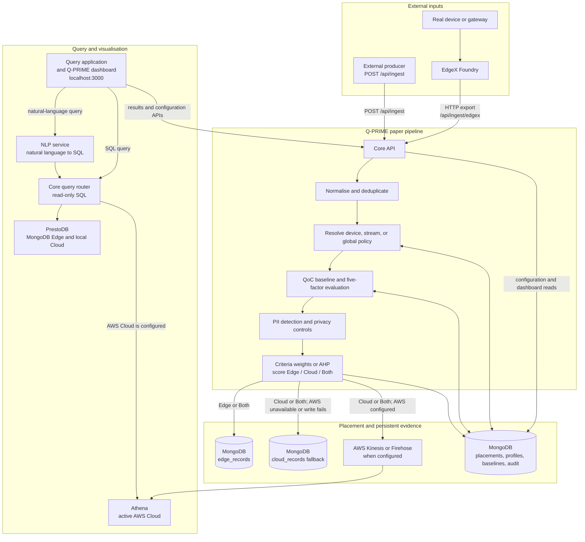

# Architecture

Q-PRIME is the paper implementation that begins after a producer has created
a raw context record. It does not generate device traffic. The same pipeline
processes a direct producer record and an EdgeX event, so both receive the
same QoC evaluation, privacy checks, weighting, placement decision, and
persistent evidence.

## Record processing and policy

A direct producer posts a canonical record to `/api/ingest`. A real-device
integration sends an EdgeX event, which the bundled HTTP-export service
forwards to `/api/ingest/edgex`. Q-PRIME normalises either payload, creates or
uses a stable record identifier, and ignores repeated deliveries.

Before scoring a record, Q-PRIME resolves the active policy in this order:
device override → stream override → global profile. The policy provides the
criteria weights directly or derives them from the AHP matrix. The pipeline
then evaluates timeliness, completeness, correctness, resolution, and
significance; detects PII; applies strict privacy controls; and calculates the
paper’s Edge and Cloud scores. A tie recommends Both.

## Placement and persistence

An Edge recommendation is retained in MongoDB `edge_records`. A Cloud
recommendation writes to AWS Kinesis or Firehose only when AWS is configured;
otherwise, or when that write fails, Q-PRIME retains the raw record in MongoDB
`cloud_records` as a local Cloud fallback. A Both recommendation applies both
active storage rules.

Every placement also writes an immutable decision record containing the QoC
scores, effective policy version, recommendation, actual backend, privacy
findings, reason, and timings. MongoDB also persists policy versions, audit
history, adaptive QoC baselines, and query metrics. Existing local Cloud
fallback records are never copied to AWS when AWS later becomes available.

## Query and dashboard paths

The query application and the `/qprime` dashboard share the Next.js web
application on port 3000 but have separate responsibilities. The query
application accepts SQL or natural-language questions; the NLP service turns
natural language into SQL, and the core query router validates that SQL before
selecting its physical source.

PrestoDB reads the MongoDB Edge and local Cloud fallback collections. When
AWS Cloud is configured, Cloud queries are sent to Athena instead; earlier
local fallback records remain in MongoDB and are not included in the active
Cloud query path. The `/qprime` dashboard reads the persistent decision,
configuration, QoC, privacy, and performance projections directly from the
core API, so it continues to show the placement history across Cloud cutover.
